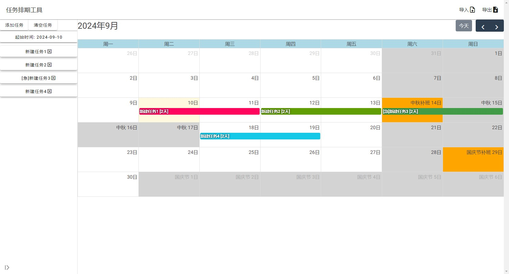

# task_arrangement_tool

任务排期工具，可访问构建好的版本，放在我的github博客上：  
[任务排期工具](https://yangxun983323204.github.io/app/task_arrangement_tool/index)  
工具特点:  
- 基于web的应用
- 基于日历面板的任务块显示，任务块可跨越多天
- 任务基于队列顺序和天数动态计算起止时间
- 日历支持中国节假日和调休安排
- 任务支持设置是否在节假日计算工时
- Json格式的导入导出

  


工程基于vue3 vite创建，下面是vue3的指南：  
## Recommended IDE Setup

[VSCode](https://code.visualstudio.com/) + [Volar](https://marketplace.visualstudio.com/items?itemName=Vue.volar) (and disable Vetur).

## Type Support for `.vue` Imports in TS

TypeScript cannot handle type information for `.vue` imports by default, so we replace the `tsc` CLI with `vue-tsc` for type checking. In editors, we need [Volar](https://marketplace.visualstudio.com/items?itemName=Vue.volar) to make the TypeScript language service aware of `.vue` types.

## Customize configuration

See [Vite Configuration Reference](https://vitejs.dev/config/).

## Project Setup

```sh
npm install
```

### Compile and Hot-Reload for Development

```sh
npm run dev
```

### Type-Check, Compile and Minify for Production

```sh
npm run build
```
